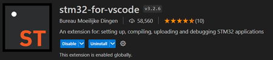

# STM32 Controller Project Mark II, Self Balancing Robot

This project involves the control of a DC motor along with LED and LCD support using an STM32 microcontroller. The user can interact with the system through the potentiometers and the joystick on the mbed application shield.

## Table of Contents
1. [Introduction](#introduction)
2. [Features](#features)
3. [Usage](#Usage)
4. [Menu Sections](#menu-sections)
   - [Manual Section](#manual-section)
   - [LED Section](#led-section)
   - [Potentiometer Section](#potentiometer-section)
   - [DC Motor Section](#dc-motor-section)
   - [Buzzer Section](#buzzer-section)
5. [Code QnA](#QnA-about-the-code)
6. [Questions](#questions-from-the-professor)

## Introduction

This project is designed to showcase the capabilities of an STM32 microcontroller in controlling a DC-motor, LEDs, and providing feedback through an LCD-display. The user can interact via two potentiometers as well as a joystick as well as a settings menu with additional options for the DC-motor and much more. The system includes various menu sections to perform specific tasks and obtain information (see [Menu Sections](#menu-sections)).

## Usage

1. Clone this git repository 
2. Install VS Code
3. Install the STM32 extension by 'Bureau Moeilijke Dingen' \*
4. Flash your STM32 MCU and have fun

\* 

## Features

### Basic Features
- DC motor control with varying speed and additional options
- Individual LED control for Green and Blue
- Potentiometer value read and display on the LCD-display

### Extra Features
- Speaker / Buzzer for playing sounds at different frequencies and a song
- Settings menu for additional control of the DC-motor
- Software smoothing of the Potentiometer's signal for the DC-motor

## Menu Sections

The menu of this MCU project was handed over by the professor , the implementation is based on the HAL library and have been adjusted to the needs of this project.

### Manual Section

This section is separated into two parts. Firstly we have the manifest of this MCU, the second part contains basic information for the MCU including a list of features (as it can be found here).

### Potentiometer Section

Displays the real-time values of both potentiometers on the LCD screen. This section allows the user to monitor and adjust the potentiometer settings.

### DC Motor Section

Controls the DC motor using the joystick and provides information on motor speed and direction. The user can adjust the motor settings for specific applications.
the following 4 options have been implemented:
- Switch_RIGHT: Motor turns clockwise
- Switch_LEFT: Motor turns counter clockwise 
- Switch_UP: Motor does a "Soft Stop"
- Switch_DOWN: Motor does a "Fast_Stop"

The input from the Potentiometer has been smoothed by an adjustable value, for a more consistent rotation speed.
Important data of the DC-motor is transmitted via USARt and can be dislpay in an application like 'hterm'.
The csv output looks as follows: "counter =   3569,Systick = 2882868,PWM_frequency = 21972, rotation_speed = 1500"

### Speaker Section

This section is split up into two subsections. The first section enables the user to play sounds at different frequencies using the buzzer. The frequency can be adjusted using the potentiometer, allowing for a customized audio experience. The second submenu plays Darth Vader’s theme song 'Imperial March' composed by John Williams for the movie 'Empire Strikes back' from 1980.

### LED Section

In this section, the user can individually turn on LEDs (except the red LED) to observe and control the lighting setup. The red LED is disabled to prevent interference with the DC motor operation.

### Settings Section

This section is split up into two subsections. The first lets you adjust the sample size for the Potentiometer to smooth out the signal for the DC-motor. The range goes from 1 (no smoothing) to 20, which is smoothing the signal quite a lot with the drawback that the refresh-rate of the motors rotational speed is visibly limited.
The second section allows the user to adjust the PSC-value for the PWM signal of the DC-motor. Per default, a prescalar value of 1 is set and there is a maximum of 40. However, a high PSC-value is not recommended, as it makes the motor not rotating smoothly.

## QnA about the code

**How is your project structured?**
- *As with every Program, the heart of the program is in the 'main.c' file. In there, every Periphery gets initialised and the main loop executes the core functionalities. Two files that stand out in the directory of the 'main.c' file are the 'myEventHandler.c' and 'myFuncs'. the 'myEventHandler.c' file handles everything about events, thus the 'mennu_entry_event', the 'menu_callback_event' and the 'menu_exit_event'. In the 'myFuncs.c' file are all important functions, such as the ones that control the CD-motor, the Potentiometers or the screen setup function. Further files with implemented code are the 'myDisplayhandler.c' and the 'music_player.c' file.*

**How is the smoothing of the Potentiometers values being done?**
- *The smoothing is done via a variable that can be adjusted in the settings. You can choose how many samples shall be taken and the mean of those samples will be the value used for the DC-motor control. This means, the more samples you want, the longer you have to wait until the mean value gets updated.*

**Why can the red-LED not be turned on in the LED-menu?**
- *It could actually fairly easily be turned on, all it takes is to turn on the DC-motor. As both Peripheries are connected to the same pin. The developer did not like to control the DC-motor outside of the function designated for this purpose. Furthermore, the Program follows a strict color code for the LED:*
   - *Blue in all the menus and submenus*
   - *Green in active functionality sections*
   - *Red for the DC-motor usage*

**How is it possible to play a song on this MCU?**
- *The code from the file 'music_player.c' originally comes from a tutorial, which my TA has recommended me. The code is adjusted and simplified (and partly translated from Italian to English), thus credits go to [Marco](https://www.youtube.com/watch?app=desktop&v=5X9cdBupEyU). In the file are two options, one using the 'HAL_delay()' function, which blocks the system and is therefore not considered for this purpose (even though the code is separated from core functionalities) and a function which makes use of the 'HAL_GetTick()' function, which does not block the CPU during runtime.*

## Questions from the professor

**What are the key facts of this Motor? (Nominal Voltage, Nominal Current, Maximum Speed, Maximum Torque)**
- *Nominal voltage is 24V*
- *Nominal current (no load) 0.06A, (max efficiency) 0.29A, (max power) 0.71A*
- *Maximum speed (no load) 6800rpm, (max efficiency) 5500rpm, (max power) 3400rpm*
- *Maximum torque (stall torque) 418gf.cm, (max efficiency) 80.0gf.cm, (max power) 209gf.cm*

**What is the minimum PWM duty cycle for the motor to run satisfactorily (smooth)?**
- *The cutoff point for my testbench seems to be around 10% of the max speed of the motor. This can vary from device to device and with a bit of testing, this cutoff point could be brought down by a few percentages.
The minimal rpm, when already running is lower than when you want to turn on the motor, this is due to the gliding friction, which is less, than the stattic friction, when the motor is turned off.*

**What is the maximum operating frequency of the motor driver?**
- *I was not able to find a specific max operating frequency for the driver itself. However, I assume that DC-motor and PWM are heavily connected. Therefore my guess is, that the maximum operating frequency of the DC-motor is the maximum frequency the PWM signal can give. *

**Which PWM frequencies make the motor whistle across the speed range?**
- *The motor starts whistling when the PWM signal reaches a high frequency. Testing has shown that the motor starts whistling around a PWM frequency of 1000Hz*

**According to DC motor theory, the speed is proportional to the applied operating voltage (duty cycle * supply voltage) over the entire duty cycle range [0...100%]. Is the DC motor theory correct?**
- *In our program, the supply voltage stays consistent and with the duty cycle (set in the capture-compare-registers) we can reach rpms from a few hundreds to the maximum which you can see in the first question. Therefore I'd count this statement as correct.*

**What does the red LED do when the motor is running? Why?**
- *As mentioned above, the red LED is on the same GPIO-EN (enable) pins as the DC-motor, which means that when the motor is turned on, the red LED will turn on automatically and same goes for turning off.*

Feel free to explore each section of the menu to understand and utilize the functionalities provided by this STM32 controller project.

{:height="150px" width="150px"}